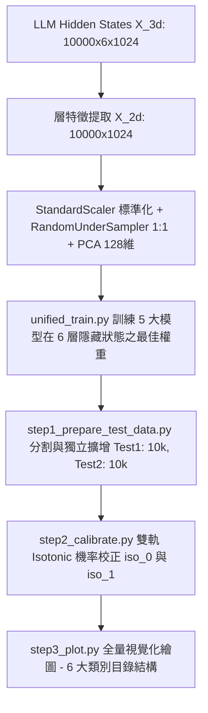

# 機器學習安全防護特徵分析：執行摘要 (Execution Summary)

本執行摘要詳細記錄了利用大型語言模型（LLM）內部特徵（Hidden States）訓練安全探針（Probes）的完整實驗設計、模型表現、優化參數以及深層數學原理。

---

## 1. 實驗目標與背景

為了評估和增強 LLM 在對抗性攻擊與常規場景下的安全表現，本專案基於 **WildJailbreak 資料集**（包含 Vanilla 原始樣本與 Adversarial 對抗性樣本）進行特徵預測與機率校正實驗。我們從 LLM 的 6 個特徵層中提取了輸入序列最後一個 Token 的隱藏狀態（`last_input_hidden_state`）作為模型特徵 $X$，特徵維度為 1024。

實驗包含三個核心分類任務：
1. **$y_1$ 任務 (Model Reply Safety)**：預測模型回覆是否包含 `unsafe` 標籤（Unsafe = 1, Safe = 0）。
2. **$y_2$ 任務 (Prompt Harmfulness)**：預測輸入 Prompt 是否有害（Harmful = 1, Benign = 0）。
3. **$y_3$ 任務 (Consistency Classification)**：預測 LLM 的安全判定是否與輸入 Prompt 的真實有害性一致（Consistent = 1, Inconsistent = 0）。一致性的定義為：
   $$y_3 = \mathbb{I}(y_1 == y_2)$$
   其中 $\mathbb{I}$ 為指示函數（Indicator Function）。當輸入提示詞有害且模型成功攔截為 unsafe，或提示詞無害且模型放行為 safe 時，$y_3$ 為 1，代表判定一致。

---

## 2. 簡化與精準化的管線架構 (Evaluation Pipeline)

我們將工作流精簡為統一、高效的 3 步驟管道（`evaluation_pipeline/`）：

1. **`unified_train.py` (探針模型訓練)**：在 10,000 筆基準訓練集中完成 5 大模型（SGD, MLP, LGB, LR, RF）在 6 層隱藏狀態下的訓練，自動保存 Validation Loss 最低點的最佳權重。
2. **`step1_prepare_test_data.py` (測試集劃分與擴增)**：切分 20% 的測試資料為 `test1` (1,000 筆) 與 `test2` (1,000 筆)，並從 75,000 筆未重疊資源池中，維持原始先驗比例擴增至 **各 10,000 筆** 樣本。
3. **`step2_calibrate.py` (條件雙軌機率校正)**：在 `test1` 上依據 `y1 == 0` (安全) 與 `y1 == 1` (不安全) 獨立訓練 `iso_0` 與 `iso_1` 保序迴歸模型，並對 `test1`、`test2` 與外部對抗評估集 `eval` 進行快取與計算。
4. **`step3_plot.py` (全量視覺化與診斷)**：提供 CLI 參數過濾器，產出符合獨立類別結構的圖表。

---

## 3. 特徵預處理與降維之數學原理

每個 LLM 層所提取的隱藏狀態特徵具有 $1024$ 維的高維度。為了防止模型過擬合並提高計算效率，我們構建了標準化的流水線（Pipeline）：

### A. 標準化 (StandardScaler)
將特徵中心化並縮放至單位變異數。對於特徵矩陣中的每一個特徵分量 $x$，其轉換公式為：
$$\hat{x} = \frac{x - \mu}{\sigma}$$
其中 $\mu$ 是訓練特徵的均值，$\sigma$ 是標準差。

### B. 隨機下採樣 (RandomUnderSampler)
由於資料集中各任務標籤存在類別不平衡，我們採用下採樣法。隨機保留多數類樣本至與少數類相同，使訓練集類別比例達到 $1:1$，避免模型偏向預測多數類。

### C. 主成分分析 (PCA)
PCA 用於將標準化後的平衡特徵降維至 $k=128$ 維。其數學步驟如下：
1. **計算共變異數矩陣 (Covariance Matrix)** $\Sigma$：
   $$\Sigma = \frac{1}{M} X_c^T X_c$$
   其中 $X_c$ 為中心化後的特徵矩陣，$M$ 為樣本數。
2. **特徵值分解 (Eigenvalue Decomposition)**：
   尋找特徵向量 $v_i$ 與特徵值 $\lambda_i$，滿足 $\Sigma v_i = \lambda_i v_i$。
3. **投影特徵**：
   選擇前 $k=128$ 個最大特徵值對應的特徵向量組成投影矩陣 $V_k \in \mathbb{R}^{1024 \times 128}$。降維後的特徵矩陣 $Z$ 表示為：
   $$Z = X_c V_k$$

---

## 4. 機率校正與 Brier 組分雙 Y 軸分析

### A. 保序迴歸 (Isotonic Regression) 雙軌求解
保序迴歸的目標是尋找一個非遞減的保序映射函數 $f(S)$，最小化均方誤差（MSE）：
$$\min_{f} \sum_{i=1}^{M} (y_i - f(S_i))^2 \quad \text{subject to } f(S_a) \le f(S_b) \text{ whenever } S_a \le S_b$$
我們基於 $y_1$ 分流，在 `test1` 上分別對 $y_1==0$ 與 $y_1==1$ 擬合 `iso_0` 與 `iso_1` PAV 演算法階梯函數。

### B. Brier 分解與雙 Y 軸圖設計 (`05_Brier_Components`)
將 Brier 分解之 **Reliability (Rel 貢獻值)** 與 **Resolution (Res 貢獻值)** 以並排柱狀圖放置於左 Y 軸，將 **Weight (樣本比例 $w_b = N_b / N$)** 以折線圖繪製於右 Y 軸，標籤明確註明：**`樣本比例 (該區間樣本數佔總數之比例)`**。

---

## 5. 圖表階層目錄結構 (`results/plots/`)

頂層資料夾為 6 大類別，內部層層嵌套：
`results/plots/<01_Metrics_Trends ~ 06_Step_Mappings>/<y1|y2|y3>/<test1|test2|eval>/layer_1~6/`

* `01_Metrics_Trends`: Brier Score 與 Log Loss 獨立隨層數變化趨勢圖。
* `02_Reliability_Curves_split_y`: 依 $y_1$ 分流 (iso_0, iso_1) 之可靠度曲線對比圖。
* `03_Quadrant_Histograms`: 2x2 全量四象限預測置信度直方圖。
* `04_Score_Histograms`: 依 $y_1$ 分流 (iso_0, iso_1) 之正負樣本預測分數直方圖。
* `05_Brier_Components`: 依 $y_1$ 分流 (iso_0, iso_1) 之 Brier 組分雙 Y 軸圖。
* `06_Step_Mappings`: 依 $y_1$ 分流 (iso_0, iso_1) 之分數映射階梯圖。
