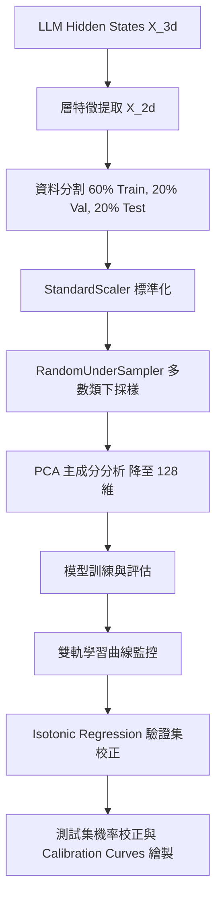

# 機器學習安全防護特徵分析：執行摘要 (Execution Summary)

本執行摘要詳細記錄了利用大型語言模型（LLM）內部特徵（Hidden States）訓練安全探針（Probes）的完整實驗設計、模型表現、優化參數以及深層數學原理。

---

## 1. 實驗目標與背景

為了評估和增強 LLM 在對抗性攻擊與常規場景下的安全表現，本專案基於 **WildJailbreak 資料集**（包含 Vanilla 原始樣本與 Adversarial 對抗性樣本）進行了雙軌特徵預測實驗。我們從 LLM 的 6 個特徵層中提取了輸入序列最後一個 Token 的隱藏狀態（`last_input_hidden_state`）作為模型特徵 $X$。

實驗包含兩個核心分類任務：
1. **$Y_1$ 任務 (Harmful Classification)**：預測輸入 Prompt 是否有害（Harmful = 1, Benign = 0）。
2. **$Y_3$ 任務 (Consistency Classification)**：預測 LLM 的安全判定是否與真實標籤一致（Consistent = 1, Inconsistent = 0）。一致性的定義為：
   $$Y_3 = \mathbb{I}(Y_1 = Y_2)$$
   其中 $Y_2$ 代表模型回覆是否包含 `unsafe` 標籤（Unsafe = 1, Safe = 0），$\mathbb{I}$ 為指示函數（Indicator Function）。

---

## 2. 整體機器學習流程架構

整個機器學習工作流由特徵預處理、特徵降維、不平衡樣本處理、模型訓練、多軌曲線分析以及機率校正組成：

---

## 3. 特徵預處理與降維之數學原理

每個 LLM 層所提取的隱藏狀態特徵具有極高的維度（例如 $4096$ 或 $5120$）。為了防止模型過擬合並提高計算效率，我們構建了標準化的流水線（Pipeline）：

### A. 標準化 (StandardScaler)
將特徵中心化並縮放至單位變異數。對於特徵矩陣中的每一個特徵分量 $x$，其轉換公式為：
$$\hat{x} = \frac{x - \mu}{\sigma}$$
其中：
- $\mu = \frac{1}{N}\sum_{i=1}^{N} x_i$ 是訓練特徵的均值。
- $\sigma = \sqrt{\frac{1}{N}\sum_{i=1}^{N} (x_i - \mu)^2}$ 是訓練特徵的標準差。

### B. 隨機下採樣 (RandomUnderSampler)
由於資料集中有害與無害樣本存在類別不平衡，我們採用下採樣法。若多數類（Majority Class）樣本數為 $N_{\text{maj}}$，少數類（Minority Class）樣本數為 $N_{\text{min}}$，下採樣會隨機保留多數類中的 $N_{\text{min}}$ 個樣本，使得訓練集的類別比例達到 $1:1$，避免模型偏向預測多數類。

### C. 主成分分析 (PCA)
PCA 用於將標準化後的平衡特徵降維至 $k=128$ 維。其數學步驟如下：
1. **計算共變異數矩陣 (Covariance Matrix)** $\Sigma$：
   $$\Sigma = \frac{1}{M} X_c^T X_c$$
   其中 $X_c$ 為中心化後的特徵矩陣，$M$ 為樣本數。
2. **特徵值分解 (Eigenvalue Decomposition)**：
   尋找特徵向量 $v_i$ 與特徵值 $\lambda_i$，滿足：
   $$\Sigma v_i = \lambda_i v_i$$
3. **投影特徵**：
   將特徵值由大到小排序，選擇前 $k=128$ 個最大特徵值對應的特徵向量組成投影矩陣 $V_k \in \mathbb{R}^{d \times k}$（其中 $d$ 為原始特徵維度）。降維後的特徵矩陣 $Z$ 表示為：
   $$Z = X_c V_k$$
   這確保了在降維的過程中，資料的投影變異數最大化，保留了最關鍵的安全表徵特徵。

---

## 4. 模型訓練與優化參數

為了全面評估特徵層的線性與非線性分類能力，我們部署了 5 種機器學習模型，並設計了 **雙軌學習曲線監控系統**：

### 雙軌監控機制
- **動態組 (SGD, MLP, LGB)**：支援 `Epoch/Tree` 逐輪迭代訓練，在每個迭代後記錄訓練集與驗證集的 Accuracy，用以評估收斂速度與是否過擬合。
- **靜態組 (LR, RF)**：使用分層 5 折交叉驗證（Stratified 5-Fold CV）評估 5 種不同資料量等級（20%, 40%, 60%, 80%, 100%）下的表現，繪製資料需求量學習曲線。

### 各模型之數學原理與調優參數

| 模型 | 方法與優化路徑 | 調優超參數 | 數學目標函數與原理 |
| :--- | :--- | :--- | :--- |
| **SGD** | 隨機梯度下降分類器 | `loss='log_loss'` `penalty='l2'` `alpha=0.01` `learning_rate='adaptive'` `eta0=0.01` Epochs = 50, Batch Size = 64 | 採用 Logistic 損失函數，目標為最小化 L2 正則化後的交叉熵： $$\min_{w, b} \frac{1}{n} \sum_{i=1}^n \log\left(1 + e^{-y_i(w^T z_i + b)}\right) + \frac{\alpha}{2} \|w\|_2^2$$ 透過隨機小批量（Mini-batch）梯度更新： $$w \leftarrow w - \eta_t \nabla_w L(w; z_i, y_i)$$ |
| **LR** | 邏輯斯迴歸 | `C=0.01` `penalty='l2'` `max_iter=1000` | 預測類別 1 的條件機率為 Sigmoid 函數： $$P(y=1\|z) = \frac{1}{1 + e^{-(w^T z + b)}}$$ 調優參數 $C=0.01$ 是正則化強度的倒數（即強正則化），目標函數為： $$\min_{w, b} \frac{1}{2} w^T w + C \sum_{i=1}^n \log\left(1 + e^{-y_i(w^T z_i + b)}\right)$$ |
| **MLP** | 多層感知機 (神經網路) | `hidden_layer_sizes=(128,)` `alpha=0.01` Epochs = 100, Batch Size = 64 | 包含一個 128 神經元的隱藏層，激活函數為 ReLU $g(u) = \max(0, u)$。輸出層使用 Sigmoid。透過反向傳播最小化交叉熵損失： $$L(W) = -\frac{1}{n}\sum_{i=1}^n [y_i\log\hat{y}_i + (1-y_i)\log(1-\hat{y}_i)] + \frac{\alpha}{2}\sum\|W\|_F^2$$ |
| **RF** | 隨機森林 | `n_estimators=100` `max_depth=10` | 基於 Bagging 思想的集成學習。透過隨機抽取樣本與特徵構建 100 棵決策樹，限制最大深度為 10 以防過擬合。最終預測結果由多棵樹投票決定： $$\hat{y} = \text{mode}\{T_1(z), T_2(z), \dots, T_B(z)\}$$ |
| **LGB** | 輕量化梯度提升機 | `n_estimators=100` `learning_rate=0.05` `max_depth=10` `num_leaves=31` `reg_alpha=0.05` `reg_lambda=0.05` `class_weight='balanced'` | 基於 Leaf-wise 葉子生長策略的 GBDT 算法。透過優化二階泰勒展開逐步疊加決策樹： $$\mathcal{L}^{(t)} \approx \sum_{i=1}^n \left[ g_i f_t(z_i) + \frac{1}{2} h_i f_t^2(z_i) \right] + \Omega(f_t)$$ 放寬 `max_depth` 與 `num_leaves` 以擬合特徵間複雜的非線性邊界，加入 L1/L2 正則化。 |

---

## 5. 機率校正：保序迴歸 (Isotonic Regression) 數學原理

在安全分類器中，模型輸出的「預測分數」必須具備物理意義（即預測分數 $S=0.8$ 代表該 Prompt 確實有 $80\%$ 的機率是有害的）。然而，經過隨機下採樣與複雜非線性分類器（如 MLP, LightGBM）擬合後，模型的輸出分數往往會嚴重失真。

為了修正此現象，我們在驗證集上擬合了 **Isotonic Regression 校正器**：

### A. 數學問題表述
已知模型在驗證集上的原始預測分數為 $S_i$，對應的真實二元標籤為 $y_i \in \{0, 1\}$。保序迴歸的目標是尋找一個非遞減（Monotonic Non-decreasing）的保序映射函數 $f(S)$，最小化均方誤差（MSE）：
$$\min_{f} \sum_{i=1}^{M} (y_i - f(S_i))^2 \quad \text{subject to } f(S_a) \le f(S_b) \text{ whenever } S_a \le S_b$$

### B. 求解演算法：Pool Adjacent Violators (PAV) 演算法
1. 將驗證集樣本按照原始預測分數 $S_i$ 從小到大排序。
2. 初始化每個點的擬合值 $f(S_i) = y_i$。
3. 從左到右掃描，若發現相鄰兩點違反單調性（即 $S_i < S_{i+1}$ 但 $f(S_i) > f(S_{i+1})$），則將這兩個點合併為一個「池（Pool）」，並將其值更新為它們真實標籤的平均值。
4. 重複此合併與平均過程，直到整個序列完全滿足單調遞增性質。

### C. 校正效果與 Bins 統計評估
評估時，我們將測試集預測分數均勻切分成 $10$ 個區間（Bins），例如 $[0.0, 0.1], (0.1, 0.2], \dots$。
對於每個 Bin $B_j$，計算：
- **平均預測分數 (Mean Predicted Value)**：$\bar{S}_j = \frac{1}{|B_j|} \sum_{i \in B_j} \hat{p}_i$
- **經驗準確率/實際正例比例 (Fraction of Positives)**：$C_j = \frac{1}{|B_j|} \sum_{i \in B_j} y_i$

未校正前，LR 與 SGD 的曲線通常呈現 Sigmoid 形狀（低估或高估兩端），而樹模型可能集中於極端。校正後，各模型的曲線均緊密貼合完美的 **$45^{\circ}$ 對角線**（$\bar{S}_j \approx C_j$），使得輸出機率能夠精準表徵安全風險程度。

---

## 6. 實驗結果與結論

1. **特徵層與分類效能關係**：隨著特徵層數的遞增（從 Layer 1 到 Layer 6），模型的各項指標（Accuracy、F1-Score、ROC AUC）均有顯著提升，這證明了 LLM 在較深層（Deep Layers）形成了更具判別力且結構化的安全表徵。
2. **模型對比**：
   - 線性模型（LR、SGD）收斂快速，但在邊界複雜的 $Y_3$ 一致性任務上略遜於非線性模型。
   - 非線性模型（LightGBM、MLP）展現出最強大的安全特徵邊界劃分能力，但未校正前機率偏離較大。
   - 經過 **Isotonic Regression** 校正後，所有模型的 Calibration Curves 均逼近理想對角線，其中 LightGBM 與 MLP 在保持高 F1-Score 的同時，實現了極佳的機率可信度，適合作為在線安全網關過濾器。
