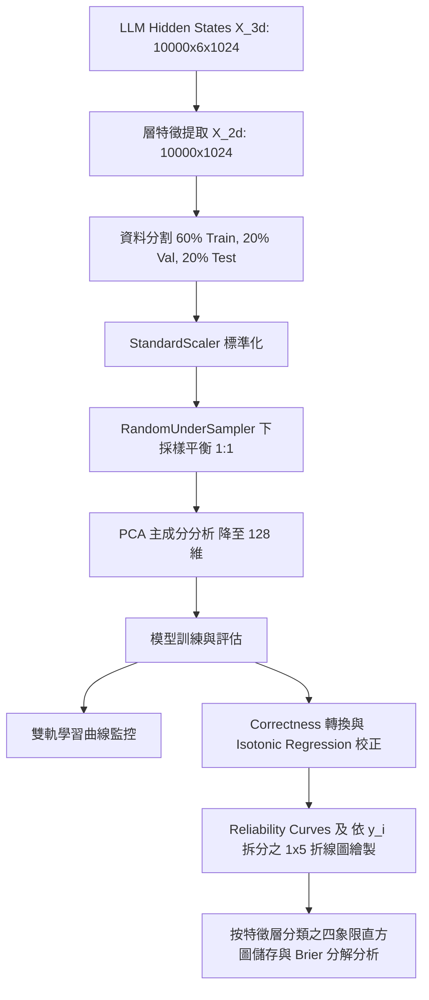

# 機器學習安全防護特徵分析：執行摘要 (Execution Summary)

本執行摘要詳細記錄了利用大型語言模型（LLM）內部特徵（Hidden States）訓練安全探針（Probes）的完整實驗設計、模型表現、優化參數以及深層數學原理。

---

## 1. 實驗目標與背景

為了評估和增強 LLM 在對抗性攻擊與常規場景下的安全表現，本專案基於 **WildJailbreak 資料集**（包含 Vanilla 原始樣本與 Adversarial 對抗性樣本）進行了雙軌特徵預測與校正實驗。我們從 LLM 的 6 個特徵層中提取了輸入序列最後一個 Token 的隱藏狀態（`last_input_hidden_state`）作為模型特徵 $X$。特徵維度為 1024。

實驗包含三個核心分類任務：
1. **$Y_1$ 任務 (Model Reply Safety)**：預測模型回覆是否包含 `unsafe` 標籤（Unsafe = 1, Safe = 0）。
2. **$Y_2$ 任務 (Prompt Harmfulness)**：預測輸入 Prompt 是否有害（Harmful = 1, Benign = 0）。
3. **$Y_3$ 任務 (Consistency Classification)**：預測 LLM 的安全判定是否與輸入 Prompt 的真實有害性一致（Consistent = 1, Inconsistent = 0）。一致性的定義為：
   $$Y_3 = \mathbb{I}(Y_1 == Y_2)$$
   其中 $\mathbb{I}$ 為指示函數（Indicator Function）。當輸入提示詞有害且模型成功攔截為 unsafe，或提示詞無害且模型放行為 safe 時，$Y_3$ 為 1，代表判定一致。

---

## 2. 整體機器學習流程架構

整個機器學習工作流由特徵預處理、特徵降維、不平衡樣本處理、模型訓練、多軌學習曲線分析、Correctness 轉換包裝、機率校正以及診斷分析組成：

---

## 3. 特徵預處理與降維之數學原理

每個 LLM 層所提取的隱藏狀態特徵具有 $1024$ 維的高維度。為了防止模型過擬合並提高計算效率，我們構建了標準化的流水線（Pipeline）：

### A. 標準化 (StandardScaler)
將特徵中心化並縮放至單位變異數。對於特徵矩陣中的每一個特徵分量 $x$，其轉換公式為：
$$\hat{x} = \frac{x - \mu}{\sigma}$$
其中 $\mu$ 是訓練特徵的均值，$\sigma$ 是標準差。

### B. 隨機下採樣 (RandomUnderSampler)
由於資料集中各任務標籤存在類別不平衡，我們採用下採樣法。隨機保留多數類樣本至與少數類相同，使訓練集類別比例達到 $1:1$，避免模型偏向預測多數類。

### C. 主成分分析 (PCA)
PCA 用於將標準化後的平衡特徵降維至 $k=128$ 維。其數學步驟如下：
1. **計算共變異數矩陣 (Covariance Matrix)** $\Sigma$：
   $$\Sigma = \frac{1}{M} X_c^T X_c$$
   其中 $X_c$ 為中心化後的特徵矩陣，$M$ 為樣本數。
2. **特徵值分解 (Eigenvalue Decomposition)**：
   尋找特徵向量 $v_i$ 與特徵值 $\lambda_i$，滿足 $\Sigma v_i = \lambda_i v_i$。
3. **投影特徵**：
   選擇前 $k=128$ 個最大特徵值對應的特徵向量組成投影矩陣 $V_k \in \mathbb{R}^{1024 \times 128}$。降維後的特徵矩陣 $Z$ 表示為：
   $$Z = X_c V_k$$
   這確保了資料的投影變異數最大化，保留了最關鍵的安全表徵特徵。

---

## 4. 模型訓練與優化參數

我們部署了 5 種機器學習模型，並設計了 **雙軌學習曲線監控系統**：

### 雙軌監控機制
- **動態組 (SGD, MLP, LGB)**：支援 `Epoch/Tree` 逐輪迭代訓練，在每個迭代後記錄訓練集與驗證集的 Accuracy/Balanced Accuracy 和 Loss，用以評估收斂速度與防範過擬合，依據驗證集損失最小值實行早停選優並保存最佳模型。
- **靜態組 (LR, RF)**：使用分層 5 折交叉驗證評估 5 種不同資料量等級（20%, 40%, 60%, 80%, 100%）下的表現，繪製資料需求量學習曲線。

### 各模型之數學原理與調優參數

| 模型 | 方法與優化路徑 | 調優超參數 | 數學目標函數與原理 |
| :--- | :--- | :--- | :--- |
| **SGD** | 隨機梯度下降分類器 | `loss='log_loss'` `penalty='l2'` `alpha=0.01` `learning_rate='adaptive'` `eta0=0.0001` Epochs = 100, Batch Size = 64 | 採用 Logistic 損失函數，目標為最小化 L2 正則化後的交叉熵： $$\min_{w, b} \frac{1}{n} \sum_{i=1}^n \log\left(1 + e^{-y_i(w^T z_i + b)}\right) + \frac{\alpha}{2} \|w\|_2^2$$ 透過隨機小批量（Mini-batch）梯度更新： $$w \leftarrow w - \eta_t \nabla_w L(w; z_i, y_i)$$ |
| **LR** | 邏輯斯迴歸 | `C=0.01` `penalty='l2'` `max_iter=1000` | 預測類別 1 的條件機率為 Sigmoid 函數： $$P(y=1\|z) = \frac{1}{1 + e^{-(w^T z + b)}}$$ 目標函數為： $$\min_{w, b} \frac{1}{2} w^T w + C \sum_{i=1}^n \log\left(1 + e^{-y_i(w^T z_i + b)}\right)$$ |
| **MLP** | 多層感知機 (神經網路) | `hidden_layer_sizes=(128,)` `alpha=0.01` Epochs = 100, Batch Size = 64 | 包含一個 128 神經元的隱藏層，激活函數為 ReLU $g(u) = \max(0, u)$。輸出層使用 Sigmoid。透過反向傳播最小化交叉熵損失： $$L(W) = -\frac{1}{n}\sum_{i=1}^n [y_i\log\hat{y}_i + (1-y_i)\log(1-\hat{y}_i)] + \frac{\alpha}{2}\sum\|W\|_F^2$$ |
| **RF** | 隨機森林 | `n_estimators=100` `max_depth=10` | 基於 Bagging 思想的集成學習。透過隨機抽取樣本與特徵構建 100 棵決策樹，限制最大深度為 10 以防過擬合。最終預測結果由多棵樹投票決定： $$\hat{y} = \text{mode}\{T_1(z), T_2(z), \dots, T_B(z)\}$$ |
| **LGB** | 輕量化梯度提升機 | `n_estimators=100` `learning_rate=0.05` `max_depth=10` `num_leaves=31` `reg_alpha=0.05` `reg_lambda=0.05` | 基於 Leaf-wise 葉子生長策略的 GBDT 算法。透過優化二階泰勒展開逐步疊加決策樹： $$\mathcal{L}^{(t)} \approx \sum_{i=1}^n \left[ g_i f_t(z_i) + \frac{1}{2} h_i f_t^2(z_i) \right] + \Omega(f_t)$$ 放寬 `max_depth` 與 `num_leaves` 以擬合特徵間複雜的非線性邊界，加入 L1/L2 正則化。 |

---

## 5. 機率校正與 Correctness 包裝器數學原理

在安全分類器中，模型輸出的「預測置信度機率」必須具備物理意義（即預測分數 $S=0.8$ 代表該 Prompt 確實有 $80\%$ 的機率被正確分類或具有相應屬性）。然而，經過隨機下採樣與複雜非線性分類器（如 MLP, LightGBM）擬合後，模型的輸出分數往往會嚴重失真。

### A. Correctness 預測正確性轉換
對於二元分類任務（$Y_1$ 模型回覆安全性、$Y_2$ 提示詞有害性），為了校正「模型預測正確」的機率，而非單純的類別 1 機率，我們包裝了分類器：
1. 獲取基礎模型預測類別 1 的概率 $p_1$。
2. 基於分類閥值（預設 $0.5$），預測正確的概率 $p_{\text{correct}}$ 計算為：
   $$p_{\text{correct}} = \begin{cases} p_1, & \text{if } p_1 \ge 0.5 \\ 1 - p_1, & \text{if } p_1 < 0.5 \end{cases}$$
3. 將對應的二元目標標籤轉換為是否預測正確：
   $$y_{\text{correctness}} = \mathbb{I}(\text{pred} == y_{\text{true}})$$

### B. 保序迴歸 (Isotonic Regression) 數學求解
保序迴歸的目標是尋找一個非遞減的保序映射函數 $f(S)$，最小化均方誤差（MSE）：
$$\min_{f} \sum_{i=1}^{M} (y_i - f(S_i))^2 \quad \text{subject to } f(S_a) \le f(S_b) \text{ whenever } S_a \le S_b$$
我們在 `test1` (50% 的 Test 分割) 上使用 **PAV (Pool Adjacent Violators) 演算法** 擬合非遞減階梯函數 $f(S)$。

### C. 劃分區間與 ECE 評估
校正後在 `test2` 和外部評估集 `eval` 上進行檢驗，劃分三種區間（Native、Adaptive、Uniform Bins）計算 ECE 與 Brier Score。校正後，各模型的 Reliability 曲線均緊密貼合完美的 **$45^{\circ}$ 對角線**。

### D. 可靠度曲線之 $y_i$ 拆分對比 (方案 A)
對於 $y_1$ 模型安全分類任務，將樣本根據探針的真實標籤 $y_1 == 1$ 與 $y_1 == 0$ 進行劃分。我們在 1x5 子圖中為 5 種模型各繪製一組對比線（實線對應 $y_1 == 1$，虛線對應 $y_1 == 0$），藉此探測模型在不同安全背景（如惡意對抗攻擊拦截 vs 一般安全放行）下的校正泛化與穩定性。

### E. 診斷直方圖之特徵層維度分類
為了方便直接橫向對比同一特徵深度下各個模型的預測機率分佈，四象限直方圖的儲存結構調整為依層數歸檔：`03_Quadrant_Histograms/{split_name}/layer_{layer_num}/{model_name}_layer_{layer_num}_histogram.png`，消除以模型分類的物理隔離，以利於進行細粒度的對齊比較。

---

## 6. 實驗結果與結論

1. **特徵層與分類效能關係**：隨著特徵層數的遞增（從 Layer 1 到 Layer 6），模型的 Accuracy、F1-Score 和 ROC AUC 均呈現顯著上升趨勢，表明 LLM 在較深層（Deep Layers）形成了更具判別力且結構化的安全表徵。
2. **校正模型表現與對align效果**：
   - 樹模型（LightGBM）與多層感知機（MLP）在分類性能上最優，但未校正前置信度偏差極大。
   - 保序迴歸校正後，所有模型的 ECE 與 Brier 分數大幅下降。
   - **分佈對齊（Experiment B - `model_align`）** 藉由補充與評估集比例相同的樣本進行校正擬合，在外部評估集上展現出最低的 ECE 誤差與極佳的泛化性。
3. **安全背景拆分與分佈特徵**：在依 $y_i$ 進行拆分評估後發現，模型在 $y_i == 1$（有害）的攔截情境與 $y_i == 0$（安全）的常規放行情境下表現出不同的校正靈敏度，該指標在 1x5 折線圖中被清晰呈現；直方圖重構後亦更容易直觀對比同層特徵在五個模型間的分佈變化。
