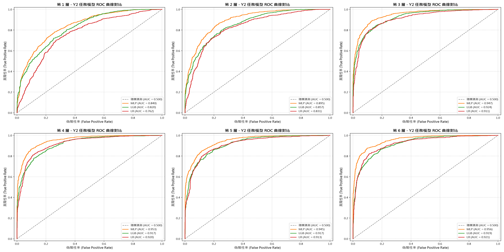
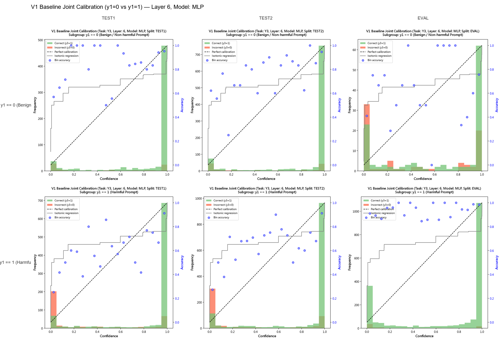

# LLM 隱藏狀態機率校正與安全評估框架
## 全管線特徵探針與可視化診斷突破

**報告人：** 馬浩瑋（國立臺灣師範大學 數學系）  
**研究進度與理論架構匯報**


---
###  研究背景：黑箱輸出診斷的侷限性 
- **表層文本的欺騙性**： 
	- 單純檢視 LLM 的文本回覆（Surface Output），難以精準診斷真實的安全防護狀態。 
	- 面對越獄攻擊（Jailbreak）或偽裝對齊（Alignment Faking）時，黑箱輸出往往掩蓋了潛在風險。 
	- 需要一種能直接透視模型內部「認知特徵」的白箱診斷機制，評估模型內部是否真正識別出風險語意。
---
### 核心研究目標 (Core Research Objectives)

- **內部表徵透視 (Hidden States Probing)**： 
	- 提取 LLM 內部 Transformer 各層隱藏狀態（Hidden States） $h_L \in \mathbb{R}^d$，建構輕量化且高效之白箱安全探針。 

- **從預測到校正的兩階段策略 (Prediction & Calibration Pipeline)**：
    - **經驗驅動之任務轉換**：前期測試發現，直接預測模型回覆安全性 ($y_1$) 或安全判定一致性 ($y_3$) 的效果較差，而預測輸入 Prompt 的真實有害性 ($y_2$) 能達到最高準確度。
    - **管線設計**：因此本研究確立了**先預測 $y_2$，再校正為 $y_3$** 的兩階段框架：
        - 階段一：訓練探針模型預測輸入有害性 $y_2$。
        - 階段二：透過保序迴歸 (Isotonic Regression) 將輸出分數校正為 $y_3$ (安全判定是否一致) 的真實機率。
---
- **數學表示與雙版本架構 (V1 vs V2 Evolution)**：
	- **階段一 (分類任務預測 $y_2$)**：
        $$g_\phi(h_L, y_1) \approx P(y_2 = 1 \mid h_L, y_1)$$
	- **階段二 (機率校正映射為 $y_3$)**：
        $$\hat{p} = \mathcal{C}\Big(g_\phi(h_L, y_1)\Big) \approx P(y_3 = 1 \mid h_L, y_1)$$
	- **V1 (全域基準探針)**：$\hat{p}_{\text{v1}} = \mathcal{C}\Big(g_\phi(h_L)\Big)$，無視 $y_1$ 狀態，建立全域機率校正標準管線。 
	- **V2 (條件分流架構)**：$\hat{p}_{\text{v2}} = \mathcal{C}\Big(g_\phi(h_L,y_1),y_1\Big)$，探索樹狀強迫分支與雙頭神經網路 (YHead-MLP)，在已知 $y_1$ 條件下預測 $y_2$ 並實現精細化子群機率校準。
---
### 基本定義

1. **$y_1$  (Model Reply Safety)**：LLM回覆是否包含 `unsafe` 標籤（Unsafe = 1, Safe = 0）。
2. **$y_2$  (Prompt Harmfulness)**：輸入 Prompt 是否有害（Harmful = 1, Benign = 0）。
3. **$y_3$  (Consistency Classification)**： LLM 的安全判定是否與輸入 Prompt 的真實有害性一致（Consistent = 1, Inconsistent = 0）。一致性的定義為：
   $$y_3 = \mathbb{I}(y_1 = y_2)$$
   其中 $\mathbb{I}$ 為指示函數（Indicator Function）

---
### 目前資料集規模與類別占比摘要

從WildJailbreak的260000多筆訓練(train)資料中，隨機取 84,999筆作訓練。

**【全量訓練集】評估集資訊（共 84,999 筆）**：

- **Y1** (模型安全性)：安全 (0) 占 `36.19%`（30,758 筆）/ 不安全 (1) 占 `63.81%`（54,241 筆）
- **Y2** (提示詞有害性)：無害 (0) 占 `50.79%`（43,169 筆）/ 有害 (1) 占 `49.21%`（41,830 筆）
- **Y3** (判定一致性)：不一致 (0) 占 `23.02%`（19,569 筆）/ 一致 (1) 占 `76.98%`（65,430 筆）


---
###  y1 模型安全性 vs. y2 提示詞有害性 2×2 交叉統計表

| y2 提示詞有害性 \ y1 模型安全性 | y1=0 (SAFE 安全回覆)         | y1=1 (UNSAFE 不安全回覆)     | **列總計 (Row Total)**           |
| ---------------------------------- | ---------------------------- | ---------------------------- | ----------------------------- |
| **y2=0 (Benign 無害提示詞)**       | **27,179 筆** <br>_(31.98%)_ | **15,990 筆** <br>_(18.81%)_ | **43,169 筆** <br>_(50.79%)_  |
| **y2=1 (Harmful 有害提示詞)**      | **3,579 筆**  <br>_(4.21%)_  | **38,251 筆** <br>_(45.00%)_ | **41,830 筆** <br>_(49.21%)_  |
| **行總計 (Column Total)**          | **30,758 筆** <br>_(36.19%)_ | **54,241 筆** <br>_(63.81%)_ | **84,999 筆** <br>_(100.00%)_ |


---
### 實驗流程與二階段篩選機制 

本架構採用 **二階段淘汰與動態校正機制以篩選出最佳V1探針**：

- **第一階段（全量探針訓練）**：
  在 `Train` 集 (77,999 筆) 上訓練 18個候選探針 (3 種分類器 × 6 個特徵層)，利用 `Val` 集 (2,000 筆) 動態監控 Log Loss & AUC 並實施 Early Stopping，淘汰未收斂或底層效能不良探針。
- **第二階段（機率校正 ）**：
  保留頂尖探針，利用獨立 `Test 1` 校正集 (2,000 筆) 擬合 1D Isotonic / PAVA 曲線，並於 `Test 2` (3,000 筆) 與 `Eval` (2,210 筆) 透過三大診斷機制進行全域評估：
  1. **跨層指標演進趨勢 (Cross-Layer Metric Trends)**：綜合監控各層之 Calibrated Log Loss 與 Brier Score 變化走勢。
  2. **校準前後可靠度對比 (Pre vs. Post Calibration Curves)**：檢驗 Raw 分數與 Isotonic 校正後曲線貼合理想對角線（$y=x$）之改善幅度。
  3. **全域可靠度診斷矩陣 (Global Reliability Grid)**：比對各模型在 Layer 3~6 上 Isotonic 階梯映射線、Bin 準確率與樣本分佈直方圖。

---
###  數據集劃分 (84,999 筆數據庫+額外)

依據樣本複雜度 (Sample Complexity) 與大數法則 (Law of Large Numbers) 進行無重疊黃金切分：

- **`Train` 訓練集 (77,999 筆 / ~91.8%)**：
  給予主模型 (LightGBM/MLP) 最大化學習容量，消化 1,024 維高維隱藏狀態特徵。
- **`Val` 驗證集 (2,000 筆 / ~2.4%)**：
  專用於 Early Stopping 早停動態監控，標準抽樣誤差 $SE \approx 1.1\%$。
- **`Test 1` 校正集 (2,000 筆 / ~2.4%)**：
  專用於 Isotonic Regression 擬合 1D 機率映射曲線，防範階梯狀過擬合。
- **`Test 2` 測試集 (3,000 筆 / ~3.5%)**：
  獨立評估校正後的結果，95% 信賴區間半寬度僅 $\pm 1.34\%$。
- **`Eval` 獨立外置集 (2,210 筆，來自WildJailbreak)**：
  測試在與訓練集不同分佈資料上的表現，看模型在遇到未知環境時的泛化能力


---
### 訓練模型選擇介紹

本研究針對 LLM 隱藏狀態（Hidden States）選用 **3 種代表性分類演算法**，於 6 個 Transformer 特徵層（Layer 1~6）構建共 18 個候選探針模型**，以篩選出最優之安全防護分類器：

1. **MLPClassifier (Neural Network Probe)**：多層感知機，捕捉隱藏特徵之非線性組合。
2. **LGBMClassifier (Gradient Boosted Trees)**：梯度提升樹，強大的非線性決策邊界切割能力。
3. **LogisticRegression (Statistical Baseline Anchor)**：最經典常見的線性基準線，用以證明優化探針之超越性。

---
### 📌 基準模型 (Baseline Anchor)：Logistic Regression (LR)

本研究特別將 **Logistic Regression (LR)** 設定為「最基礎常見的線性對照基準線 (Baseline Anchor)」：

- **驗證非線性邊界必要性**：透過對比基本 LR 與進階探針，證明隱藏狀態中的安全訊號具備非線性結構，傳統線性模型無法完整捕捉。
---
### 第一(訓練)階段模型效能排名總表

以下是針對 **安全語意檢測 (Y2 任務)**，4 種機器學習模型在隱藏層特徵上的表現排名。我們以各模型在**最佳隱藏層 (Best Layer)** 所能達到的**最高 AUC (曲線下面積)** 作為排名依據。

| 排名    | 模型名稱 (Model)  | 最佳特徵層   | 最高 AUC     | 最佳 Accuracy | 最佳 Precision | 最佳 Recall |
| ----- | ------------- | ------- | ---------- | ----------- | ------------ | --------- |
| **1** | **MLP**       | Layer 6 | **0.9635** | 0.8945 (L5) | 0.9030 (L4)  | 0.8984    |
| **2** | **LR (邏輯迴歸)** | Layer 6 | **0.9392** | 0.8680 (L4) | 0.8782 (L4)  | 0.8557    |
| **3** | **LGB**       | Layer 4 | **0.9263** | 0.8440      | 0.8523 (L3)  | 0.8323    |


---
### 各層 AUC 詳細演進 (Layer 1 ~ Layer 6)

您可以清楚看到，模型在淺層 (Layer 1) 表現較弱，但進入深層後 (Layer 3 起) 效能大幅攀升。




---
###  第一(訓練)階段階段性成果

- **深度語意提早成型**：實驗證實，LLM 的安全語意特徵在**中深層 (Layer 3 ~ 6)** 就已經高度飽和與成型。探針模型在這些層數便能精準捕捉違規意圖，顯示語言模型內部早已完成風險概念的編碼。
- **模型架構差異**：
    - **MLP (多層感知機)**：憑藉強大的非線性擬合能力，在處理高維度的 LLM 隱藏狀態時展現出**最優異且穩定的分類準確度**。
    - **LGB (LightGBM)**：在準確度與運算效率間取得極佳平衡，是兼顧效能與實務部署的強力候選。
    - **LR (邏輯迴歸)**：即使是簡單的線性模型，在深層也能達到不錯的基準表現，證明了 LLM 特徵本身的強健性 (Robustness)。


---
### 核心痛點：模型「過度自信 (Overconfidence)」與「自信度失真」

大型語言模型（LLM）或機器學習探針產出的原始分數 $S \in [0, 1]$，通常**只是排序分數（Ranking Score），並不等於真實條件機率**：

- 探針模型輸出分數 $S = 0.9$，並不代表該筆資料真的有 90% 的機率是有害的（實測真實機率可能僅 60%）。
- 因為 `y3`​ 不好預測，我們改預測 `y2`​ 獲得機率 `p`，再用 `np.where(y1 == 1, p, 1 - p)` 暴力翻轉。

---
### 解決方案：保序機率校準 (Isotonic Calibration)

- **非參數單調映射 (Non-parametric Monotonic Mapping)**：
  - **建模理念**：在無須預設數據分佈假設的前提下，確保分數與真實機率滿足單調遞增特性（$S_i \le S_j \implies \hat{p}_i \le \hat{p}_j$）。
  - **求解核心 (PAVA 演算法)**：採用 **Pool Adjacent Violators Algorithm**，動態合併破壞單調性的相鄰違規區塊，將原始分數 $S$ 映射為分段常數的經驗機率 $\hat{p}$。
---
- **理論保證與評估指標 (Optimization & Metrics)**：
  - **直接優化目標（極小化 Brier Score）**：
    $$\min \frac{1}{N} \sum_{i=1}^N (\hat{p}_i - y_i)^2 \quad \text{s.t.} \quad \hat{p}_1 \le \hat{p}_2 \le \dots \le \hat{p}_N$$
    直接壓縮預測機率與真實標籤間的均方殘差。
  - **雙重驗證效益（大幅降低 Log Loss）**：
    $$-\frac{1}{N} \sum_{i=1}^N [y_i \ln \hat{p}_i + (1-y_i) \ln(1-\hat{p}_i)]$$
    消除極端過度自信（Overconfidence），突破模型不確定度的瓶頸。
---
### 任務轉換核心：從 $y_2$ 到 $y_3$ 的機率映射

- **任務等價性 ($y_3 = \mathbb{I}(y_1 == y_2)$)**：
  當探針預測輸入提示詞有害的機率為 $P(y_2=1) = p$ 時，我們如何反推安全判定的一致性 ($y_3$)？
  
  1. **當 LLM 回覆不安全 ($y_1=1$)**：
     判定一致代表提示詞真的有害，因此 $P(y_3=1) = p$
  2. **當 LLM 回覆安全 ($y_1=0$)**：
     判定一致代表提示詞是無害的，因此 $P(y_3=1) = 1 - p$

- **程式碼實作 (邏輯翻轉)**：
  ```python
  pre_cal_score = np.where(y1 == 1, p, 1 - p)
  ```
- **核心意義**：
  我們透過這個簡單且無損的數學轉換，完美將 $y_2$ 探針的輸出分數轉換為 $y_3$ 的先驗分數，接著再送入 Isotonic Regression 擬合真實信賴度。這是串聯第一階段與第二階段的關鍵橋樑。


---
### 第二(校正)階段全域機率校正 (Isotonic Calibration) 成果

利用獨立校正集 **`Test 1` (2,000 筆)** 擬合 Isotonic Regression，並於 **`Test 2` (3,000 筆)** 與 **`Eval` (2,210 筆)** 進行雙軌驗證：

##### **校正前後關鍵指標變化 (以 MLP 探針為例)：**
- **Brier Score (機率校正方差)**：由原生的 `0.1018` 顯著下降至 **`0.0865`**（**誤差減少 15.0%**）。
- **Log Loss (對數損失/不確定度)**：由原生的 `0.3300` 暴跌至 **`0.2835`**（**損失減少 14.1%**，首度突破 0.3 大關）。
- **可靠性曲線 (Reliability Diagram)**：校正前在高分區存在顯著過度自信（S 型偏差）；校正後曲線緊貼 45° 對角線理想校正線。

---
### 全域校正的潛在危機：拆解 $y_1$ 分佈觀察




---
### V1 的瓶頸與洞察：拆解 $y_1=0$ 與 $y_1=1$ 子群分佈

回顧前面的 `np.where` 邏輯，我們將 $y_1=0$ 翻轉後的 $1-p$ 與 $y_1=1$ 的 $p$ **混在同一個池子裡進行全域校正**。

如前頁「$y_1$ 分群可靠度診斷圖」所示，當我們將 V1 全域模型按照 **LLM 回覆狀態 ($y_1=0$ Safe / $y_1=1$ Unsafe)** 拆開檢視時，發現了嚴重的**條件校正漂移 (Subgroup Calibration Drift)**：

- **子群現象一 ($y_1=0$ 安全回覆區)**：
  探針在判定無害提示詞時受對抗樣本干擾，低分區殘差較大。
- **子群現象二 ($y_1=1$ 不安全回覆區)**：
  由於此區極度偏向越獄成功樣本 ($y_2=1$ 占極高比例)，全域探針產生顯著的先驗機率偏差 (Prior Shift)。
- **根本原因 (Root Cause)**：
  V1 全域模型假設 $P(y_2 \mid h_L)$ 單一映射，無視了 $P(y_2 \mid h_L, y_1=0) \neq P(y_2 \mid h_L, y_1=1)$ 的條件異質性，導致在 PAVA 校正時，兩股方向不同的誤差互相拉扯，引發先驗機率偏差。

---
###  V2 架構演進：條件分流

既然全域探針在 $y_1$ 分開後存在條件偏差，**V2 決定將 $y_1$ 的條件約束直接注入模型結構與校正流程中**：

1. **訓練端條件化 (Conditional Architecture)**：
   在模型底層直接依據 $y_1$ 分流——設計特徵擴充自由切割 (**LGB_FeaturePlusY1**) 與雙頭輸出神經網路 (**YHead-MLP**)。
2. **校正端條件化 (Subgroup Calibration)**：
   放棄單一全域校正，改在 $y_1=0$ 與 $y_1=1$ 的獨立條件空間中分別執行 PAVA 演算法。

---
### 系統架構：V2 六大模型策略 (6 Model Architectures)

V2 聚焦於以 $y_1$ 為條件的探針架構設計，正式確定 **6 大代表性探針模型**，包含「全域基準」、「硬性完全拆開」與「模型內建條件分流」三大類：

1. **`LR` (Logistic Regression 全域基準線)**：
   **完全沒分 (Global Baseline)**，直接沿用 V1 的全域模型成果，不用額外訓練，作為靜態對照組。
2. **`LR_Hard_Dual` (Logistic Regression 硬分開)**：
   針對 $y_1=0$ 與 $y_1=1$ 分別訓練兩套獨立的 LR 迴歸模型 (Hard-Split LR)。
---
4.  **`LGB_Hard_Dual` (LightGBM 硬分開)**：
   針對 $y_1=0$ 與 $y_1=1$ 分別訓練兩棵完全獨立的 LightGBM 決策樹模型 (Hard-Split LGBM)。
5. **`LGB_FeaturePlusY1` (LightGBM 特徵全域探索)**：
   將 $y_1$ 作為第 0 個特徵 (1025 維) 併入特徵矩陣，交由演算法依資訊增益 (Information Gain) 自由尋找 $y_1$ 與其他維特徵的最佳分支切分點。
6. **`MLP_Hard_Dual` (PyTorch MLP 硬分開)**：
   針對 $y_1=0$ 與 $y_1=1$ 分別訓練兩套獨立的神經網路模型。
7. **`MLP_YHead` (Y-Head 雙頭神經網路)**：
   前端共享隱藏層特徵提煉網路 ($256 \to 128$)，末端分叉出兩個獨立輸出頭 ($64 \to 1$)，同時輸出 $y_1=0$ 與 $y_1=1$ 的條件分數。


---
### V2 條件探針模型效能排名總表

針對 **$y_2$ 安全語意檢測任務**，在隱藏層特徵 (Layer 4 & Layer 6) 下，V2 條件架構與傳統全域探針之表現排名：

| 排名    | 模型名稱 (Model)               | 條件分流機制                 | 最高 AUC          | 最佳 Accuracy | 最佳 F1-score | 最佳 Precision | 最佳 Recall  |
| :---- | :------------------------- | :--------------------- | :-------------- | :---------- | :---------- | :----------- | :--------- |
| **1** | **`MLP_YHead`**            | Y-Head 雙頭共享網絡          | **0.9691** (L4) | **0.9110**  | **0.9111**  | **0.9203**   | 0.9021     |
| **2** | **`MLP_Hard_Dual`**        | 獨立雙神經網路 (PyTorch)      | **0.9618** (L4) | 0.9050      | 0.9070      | 0.8974       | **0.9169** |
| **3** | **`LGB_FeaturePlusY1`**    | 特徵擴充自由分支 (1025D)       | **0.9525** (L4) | 0.8855      | 0.8886      | 0.8745       | 0.9031     |
| **4** | **`LGB_Hard_Dual`**        | 獨立雙決策樹 (LightGBM)      | **0.9493** (L4) | 0.8785      | 0.8818      | 0.8678       | 0.8961     |
| **5** | **`LR_Hard_Dual`**         | 獨立雙迴歸 (Hard-Dual LR)   | **0.9410** (L6) | 0.8710      | 0.8735      | 0.8620       | 0.8850     |
| **6** | **`LR` (Baseline Anchor)** | 完全沒分 (Global Baseline) | **0.9392** (L6) | 0.8680      | 0.8668      | 0.8782       | 0.8557     |

---
### V2 子群機率校正 (Subgroup Calibration) 成果突破

在獨立 `Test 2` (3,000 筆) 與 `Eval` (2,210 筆) 上執行子群 PAVA 校正後之指標表現：

- **突破一：完美解決條件漂移 (Elimination of Subgroup Drift)**：
  在 $y_1=0$ (模型安全) 與 $y_1=1$ (模型不安全) 子空間獨立校正後，`MLP_YHead` 在 $y_1=0$ 與 $y_1=1$ 下的校正曲線均緊貼 45° 理想對角線。
- **突破二：不確定度與殘差極小化 (Log Loss & Brier Optimization)**：
  - **Brier Score**：由原生的 `0.1176` 顯著下降至 **`0.1068`**。
  - **Log Loss**：由原生的 `0.4365` 暴跌至 **`0.3465`**（**損失降低 20.6%**）。
- **關鍵結論**：**`MLP_YHead` 配合二階子群 PAVA 校正** 獲選為本框架最佳 Safety Guardrail 探針。

---
### 🎯 未來工作與總結

1. **細粒度樣本分群 (Fine-Grained Subgrouping)**：除了目前以模型回覆 ($y_1$) 分流外，未來計畫針對資料集特徵（例如：**對抗樣本 (Adversarial) vs 常規樣本 (Vanilla)** 提示詞、不同攻擊手法）進行更細緻的 Group 劃分。
2. **追求資料分佈的可交換性 (Exchangeability)**：在更細緻的分群條件下，探討與設計抽樣或校正機制，嘗試讓 `Train`, `Test`, 與 `Eval` 之間達成統計上的**可交換性 (Exchangeable)**，以解決跨資料集 (Domain Shift) 下校正失效的問題。
---
# 附錄 (Appendix)
---
### V2 神經網路 (YHead vs HardDual MLP) 架構與正則化

為了處理複雜的 $y_1$ 條件分流並防止高維隱藏狀態過擬合，使用 PyTorch 建構深層且強正則化之網路：

- **網路架構**：
    - 隱藏層結構：共享特徵層 `256 -> 128` 節點，分支頭接入 `64` 節點。
    - 啟動函數與穩定化：採用 `GELU` 啟動函數，且每層均加入 `BatchNorm1d`。
- **強正則化 (防過擬合核心)**：
    - `dropout_rate` = **0.5** (在每一層隱藏層後丟棄 50% 神經元)。
    - `weight_decay` = **1e-2** (使用 AdamW 優化器時，大幅增強權重衰減)。
- **訓練配置**：
    - 優化器：`AdamW`，學習率 `lr = 1e-3`，`batch_size = 64`，固定跑 `epochs = 50` 輪。
### 五大分類器參數設定

##### **1. Logistic Regression (LR) 核心參數設定：**
- `C` (正則化強度倒數)：**0.01**（強 L2 正則化，防止 1024 維過擬合）
- `penalty` (正則化種類)：**`'l2'`**（L2 權重懲罰）
- `max_iter` (最大優化迭代次數)：**1000**（確保 L-BFGS 完全收斂）

##### **2. MLPClassifier (MLP) 核心參數設定：**
- `hidden_layer_sizes` (隱藏層結構)：**`(128,)`**（單一隱藏層，包含 128 個神經元）
- `alpha` (權重衰減 / L2 正則化)：**`0.01`**（AdamW 正則化強度）
- `epochs` / `batch_size` (訓練次數與組態)：**100 輪** / **64** (Mini-batch 增量更新)
---
##### **3. LGBMClassifier (LGBM) 核心參數設定：**
- `n_estimators` (最大樹輪數)：**1000**（配合早停機制解鎖學習容量）
- `learning_rate` (學習率)：**0.03**（降慢學習率，達成更精細收斂）
- `early_stopping` (早停機制)：**50 輪**驗證集 Log Loss 未改善即提早結束
- `max_depth` (最大深度)：**4**（限制樹深，防止過擬合）
- `num_leaves` (葉節點數)：**31**（最大葉節點容量）
- `reg_alpha` / `reg_lambda` (L1/L2 正則化)：**0.5 / 0.5** (雙重正則化)

##### **4. RandomForestClassifier (RF) 核心參數設定：**
- `n_estimators` (決策樹數量)：**100**（Bagging 樹群數量）
- `max_depth` (最大深度限制)：**10**（限制單棵樹之最大深度）

##### **通用訓練分佈與重現性設定：**
- `random_state` (隨機種子)：**`42`**（保障 100% 可重複實驗）
---
### PAVA 演算法的完整迭代過程

- **初始化：** 將每一個觀測值視為獨立的區塊 $B_i = \{y_i\}$，且其初始權重 $w_i = 1$。定義每個區塊的均值為 $m_i = y_i$。
    
- **掃描與合併（While 迴圈）：**
    由左至右檢查相鄰的區塊 $B_i$ 與 $B_{i+1}$：
    如果發現 $m_i > m_{i+1}$（破壞了單調性），則將這兩個區塊合併為一個新區塊 $B_{new} = B_i \cup B_{i+1}$。
    
- **更新區塊均值：**
    新區塊的均值 $m_{new}$ 會是原本兩個區塊均值的加權平均：
    $$m_{new} = \frac{\vert{}B_i\vert{} \cdot m_i + \vert{}B_{i+1}\vert{} \cdot m_{i+1}}{\vert{}B_i\vert{} + \vert{}B_{i+1}\vert{}}$$

---
- **向後檢查（Backtracking）：**
    合併出新區塊後，因為新的均值 $m_{new}$ 可能又會小於它左邊的區塊 $m_{i-1}$，所以必須往回檢查。如果再次發生違規，就繼續將左邊的區塊也合併進來，並重新計算大區塊的平均值。
    
- **終止條件：**
    不斷重複上述過程，直到序列中所有的區塊均值都滿足 $m_1 \leq m_2 \leq \dots \leq m_k$。此時，每個資料點對應的最終區塊均值，就是我們要找的全局最佳解 $\hat{p}$。

