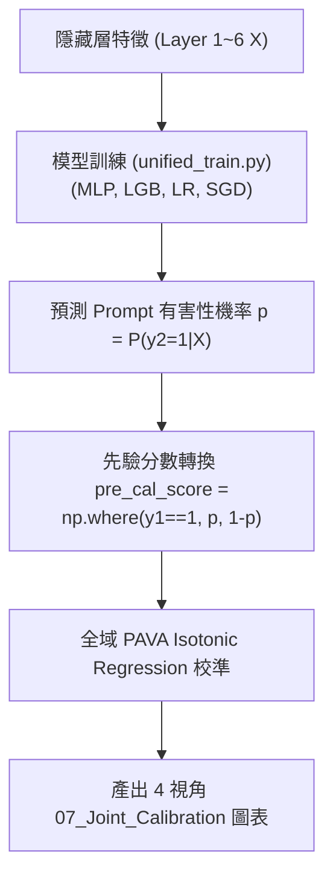

# LLM 隱藏狀態機率校正與元評估框架 (LLM Hidden State Calibration & Meta-Evaluation Framework)

本專案旨在透過分析 LLM 內部隱藏層（Layer 1 ~ Layer 6 Hidden States）特徵，評估並校準安全護欄（Safety Guardrails）對目標預測的概率可靠度。

---

## 📌 1. 核心符號定義與先驗分數轉換邏輯 ($y_1, y_2, y_3$)

在 LLM 安全防護體系中，我們定義了三個核心標籤：

* **$y_1$（LLM 回覆安全性）**：$y_1 = 0$ 代表模型回覆安全（Safe），$y_1 = 1$ 代表模型回覆不安全/拒絕（Unsafe）。
* **$y_2$（輸入 Prompt 有害性）**：$y_2 = 0$ 代表輸入提示詞無害（Benign），$y_2 = 1$ 代表輸入提示詞有害（Harmful）。
* **$y_3$（安全判定一致性）**：$y_3 = \mathbb{I}(y_1 == y_2)$，代表護欄判定與 Prompt 有害性是否一致。

### 🚨 先驗分數轉換公式 (Prior Score Transformation)
模型（如 LightGBM、MLP、Logistic Regression）訓練的直接目標是預測提示詞有害性 $y_2$（即輸出機率 $p = P(y_2 = 1 \mid X)$）。在進行概率校準前，**必須**先透過以下公式將 $p$ 轉換為 $y_3$ 的先驗分數：

$$\text{pre\_cal\_score} = \begin{cases} p & \text{if } y_1 = 1 \\ 1 - p & \text{if } y_1 = 0 \end{cases} = \text{np.where}(y_1 == 1, p, 1 - p)$$

---

## 🏗️ 2. V1 Baseline 訓練與校準 Pipeline

V1 第一階段的完整執行管道包含以下步驟：

### V1 Baseline 的致命缺陷：子群雙向系統性機率偏差 (Subgroup Drift)
V1 採用的 **Global Calibration（全域統一校準）** 將 $y_1=0$ 與 $y_1=1$ 的資料混在同一個池子裡進行 PAVA 校準。這無視了兩群資料的條件異質性，引發嚴重的雙向偏差：
* **無害提示詞 ($y_1 = 0$) — 虛高 / 過度防禦**：`bias_g0` 為 **+4.1% ~ +7.0%**（對無害 Prompt 估算風險偏高，高誤報率/狼來了效應）。
* **有害提示詞 ($y_1 = 1$) — 虛低 / 防禦不足**：`bias_g1` 為 **-6.0% ~ -8.1%**（對有害 Prompt 低估風險，造成安全漏洞/漏報風險）。

---

## ⚡ 3. V2 條件式框架 (Conditional Framework)

為解決 V1 全域校準的雙向偏差痛點，V2 提出了條件式訓練與分流校準機制：

1. **硬分流策略 (Hard-Split)**：
   * `RootSplit_LGBM` 與 `LR_Hard_Dual`：依據 $y_1=0$ 與 $y_1=1$ 將樹結構或線性邊界強制拆開訓練與獨立 PAVA 校準。
2. **雙頭神經網絡 (`MLP_YHead`)**：
   * 主幹（Shared Trunk）共享隱藏層特徵以防止資料切分導致的數據稀疏（Data Sparsity）。
   * 雙頭（Head 0 對應 $y_1=0$，Head 1 對應 $y_1=1$）獨立輸出與校準。
   * **實證成果**：Validation 集 AUC 達到 **0.95+**，Brier Score 全面降低至 `0.063 ~ 0.079`，完美消除雙向偏差。

---

## 📊 4. 07_Joint_Calibration 4 視角圖表矩陣 (Task 4 規範)

為全方位分析校準前後與語境條件的差異，V1 繪圖腳本支援以下 4 種 `07_Joint_Calibration` 雙維度對比圖表：

| 圖表視角 | X 軸分數類別 | $y_1$ 語境條件 | 觀察重點與業務意義 |
| :--- | :--- | :--- | :--- |
| **圖一** | **舊分數** (Uncalibrated Raw Score) | **不分 $y_1$** (Overall) | 觀察模型原始輸出的 Confidence 直方圖與未校準 Bin Accuracy 曲線。 |
| **圖二** | **新分數** (Calibrated Score) | **不分 $y_1$** (Overall) | 觀察全域 Isotonic 校準後整體 Reliability 曲線的全局修正效果。 |
| **圖三** | **舊分數** (Uncalibrated Raw Score) | **分 $y_1$** ($y_1=0$ vs $y_1=1$) | 觀察未校準前在一般提示詞與有害提示詞子群上的原始機率佈局。 |
| **圖四** | **新分數** (Calibrated Score) | **分 $y_1$** ($y_1=0$ vs $y_1=1$) | 展示全域校準後對 $y_1=0$（+6% 虛高）與 $y_1=1$（-8% 虛低）的**子群雙向系統性偏差**，作為引出 V2 的實證依據。 |

---

## 📂 5. Git 同步與大型檔案/權重管理規範

依據 `.gitignore` 規範，專案檔案分為「可直接同步至 Git/GitHub」與「無法同步至 Git（需手動雲端/隨身碟備份）」兩類：

### 🟢 可自動同步至 Git / GitHub (Allowed in Git)
* **程式碼與批次檔**：所有 `.py` 腳本、`.bat` 批次檔、`pyproject.toml`。
* **文件與報告**：`README.md`、`AI_INSTRUCTIONS.md`、`執行結果.md`、`reports/` 報告。
* **結果視覺化與日誌**：`results/` 底下的所有 PNG 圖檔 (`*.png`)、日誌與文字結果 (`*.txt`, `*.log`, `*.md`)。

### 🔴 無法同步至 Git (Gitignored - 需使用雲端硬碟/隨身碟手動備份)
若更換電腦或在其它環境部署，以下二進制大檔與資料集被 `.gitignore` 阻擋，**必須手動透過雲端硬碟備份與轉移**：

1. **`data/` 目錄下的所有原始資料集**：
   * `data/v1_train_full.pkl`
   * `data/v1_val.pkl`
   * `data/v1_test1.pkl`, `data/v1_test2.pkl`
   * `data/experiment_results_train.pkl`, `data/experiment_results_eval.pkl`
2. **`models/` 目錄下的所有模型權重與 Pipeline 檔**：
   * `models/v1_baseline/**/*.pkl` (SGD, MLP, LGB, LR 權重檔)
   * `models/v2_framework/**/*.joblib` (`MLP_YHead`, `RootSplit_LGBM` 等權重檔)
3. **`cache/` 目錄下的中間預測與評估快取**：
   * `cache/v1_baseline/calibration/without_pca/calibrated_predictions.pkl`
   * `outputs/v2_framework/**/*.joblib`
