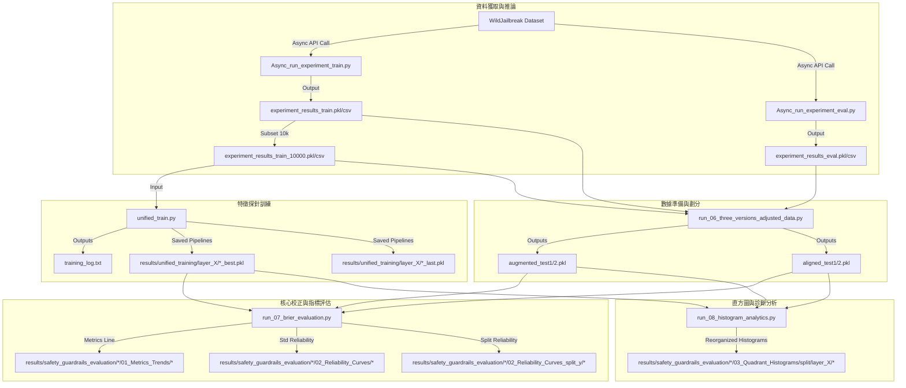

# LLM 安全防護特徵分析、特徵探針與 post-hoc 機率校正架構報告

本報告全面、詳盡地解析了本專案的技術設計、數學原理、程式碼架構與實驗發現。本專案旨在利用大型語言模型（LLM）內部的激活特徵（Hidden States）訓練安全特徵探針（Probes），並結合保序迴歸（Isotonic Regression）進行後驗（post-hoc）機率校正，以增強 LLM 安全分類器在分佈偏移（Covariate Shift）下的預測準確度與機率可靠性。

---

## 📌 目錄
1. [專案背景與核心任務](#1-專案背景與核心任務)
2. [資料來源、格式與特徵工程](#2-資料來源格式與特徵工程)
3. [統一機器學習特徵探針框架 (`unified_train.py`)](#3-統一機器學習特徵探針框架-unified_trainpy)
4. [資料集調整、核心校正基準評估與 $y_i$ 拆分可靠度分析 (`run_06`, `run_07`)](#4-資料集調整核心校正基準評估與-y_i-拆分可靠度分析-run_06-run_07)
5. [預測正確性四象限診斷與直方圖分析 (`run_08`)](#5-預測正確性四象限診斷與直方圖分析-run_08)
6. [專案檔案與數據流全景圖](#6-專案檔案與數據流全景圖)
7. [核心實驗發現與技術結論](#7-核心實驗發現與技術結論)

---

## 1. 專案背景與核心任務

### 1.1 背景與研究價值
隨著 LLM 被廣泛部署，如何防範惡意對抗性提示詞（如 Jailbreak 越獄攻擊）成為核心議題。傳統的安全對齊主要依賴於 RLHF 或安全提示詞過濾，但這些方法位於模型外部或最終輸出端。
本專案採用**特徵探針（Representation Probing）**技術，直接讀取 LLM 隱藏層的神經元激活狀態（Hidden States），在模型尚未輸出文字前判定輸入 Prompt 是否有害、模型的回覆是否安全，以及安全判定是否一致。這對於構建在線安全網關（Safety Guardrails）具有極高的物理推理速度與準確度優勢。

### 1.2 三大預測任務之數學定義
在機器學習流程中，定義了三個分類任務：
1. **$y_1$ 任務 (模型回覆安全性預測，Model Reply Safety)**：
   - **目標**：預測 LLM 的最終回應是否安全。
   - **標籤**：$y_1 = 1$ 代表模型回覆為「不安全 (UNSAFE)」；$y_1 = 0$ 代表模型回覆為「安全 (SAFE)」。
   - **標籤提取**：`df['model_reply'].str.lower().str.contains('unsafe').astype(int)`。
2. **$y_2$ 任務 (提示詞有害性預測，Prompt Harmfulness)**：
   - **目標**：預測輸入 Prompt 本身是否包含有害意圖。
   - **標籤**：$y_2 = 1$ 代表提示詞為「有害 (Harmful)」；$y_2 = 0$ 代表提示詞為「無害 (Benign)」。
   - **標籤提取**：`df['data_type'].str.contains('harmful').astype(int)`。
3. **$y_3$ 任務 (安全判定一致性預測，Safety Consistency)**：
   - **目標**：預測模型的判定是否與真實標籤相符。
   - **標籤**：$y_3 = 1$ 代表「一致 (Consistent)」；$y_3 = 0$ 代表「不一致 (Inconsistent)」。
   - **數學定義**：
     $$y_3 = \mathbb{I}(y_1 == y_2)$$
     其中 $\mathbb{I}$ 是指示函數。當 $y_1 = y_2$ 時，表示：
     - 模型回覆不安全且提示詞確實有害（成功攔截，Consistent）。
     - 模型回覆安全且提示詞確實無害（正常通行，Consistent）。

---

## 2. 資料來源、格式與特徵工程

### 2.1 原始資料集 (WildJailbreak)
專案數據來自 AllenAI 開源的 [WildJailbreak](https://huggingface.co/datasets/allenai/wildjailbreak) 資料集。該資料集由兩大分佈構成：
- **Vanilla (常規樣本)**：一般的日常對話，分為 benign 與 harmful。
- **Adversarial (對抗性樣本)**：經過越獄模版或暗語包裝的惡意提示詞，具有極高的防禦挑戰性。

### 2.2 特徵工程與維度資訊
在調用 LLM 推理時，非同步推論腳本（`Async_run_experiment_train.py` 和 `Async_run_experiment_eval.py`）向支持特徵返回的端點發送請求。LLM 在處理 Prompt 的最後一個 Token 時，提取其在 **6 個特定隱藏層** 的活化狀態（`last_input_hidden_state`）。
- **特徵維度**：$X \in \mathbb{R}^{M \times 6 \times 1024}$，其中：
  - $M$ 是樣本筆數。
  - $6$ 是隱藏層的數量（例如 Layer 1 到 Layer 6）。
  - $1024$ 是每一層隱藏層的特徵維度。
- **數據集大小**：
  - **基準訓練集 (`experiment_results_train_10000.pkl`)**：包含實體數據 $10,000$ 筆。
  - **全量訓練集 (`experiment_results_train.pkl`)**：包含約 $85,000$ 筆數據（作為補充擴充的數據池）。
  - **外部評估集 (`experiment_results_eval.pkl`)**：包含實體數據 $2,210$ 筆（只有對抗樣本，無常規樣本，存在明顯的分佈偏移）。

---

## 3. 統一機器學習特徵探針框架 (`unified_train.py`)

### 3.1 資料預處理流水線 (Pipeline)
為確保特徵在各模型間的兼容性與泛化力，對每個層的 $2\text{D}$ 特徵矩陣 $X_{\text{layer}} \in \mathbb{R}^{M \times 1024}$ 構建了以下流水線：
1.  **資料分割 (Data Splitting)**：使用分層分割（Stratified Split）將資料按 $60\%(\text{Train}) : 20\%(\text{Val}) : 20\%(\text{Test})$ 分割。
2.  **標準化 (StandardScaler)**：將訓練集的特徵縮放為均值為 $0$、方差為 $1$。
3.  **不平衡處理 (RandomUnderSampler)**：由於有害與無害樣本的分佈不均，利用隨機下採樣丟棄多數類樣本，使訓練集的類別比率達到 $1:1$。
4.  **降維 (PCA)**：使用主成分分析將 $1024$ 維特徵降維至 $k=128$ 維。

### 3.2 五大分類器與訓練參數

#### 3.2.1 隨機梯度下降分類器 (SGD) - [動態組]
- **原理**：最小化 L2 正則化後的 Logistic 損失函數：
  $$\min_{w, b} \frac{1}{n} \sum_{i=1}^n \log\left(1 + e^{-y_i(w^T z_i + b)}\right) + \frac{\alpha}{2} \|w\|_2^2$$
- **超參數**：`loss='log_loss'`, `penalty='l2'`, `alpha=0.01`, `learning_rate='adaptive'`, `eta0=0.0001`。
- **訓練監控**：執行 100 個 Epochs 的 `partial_fit`，在每個 Epoch 後計算驗證集的 Log Loss，保存 Loss 最低的最佳模型（`*_best.pkl`）與最後一輪模型（`*_last.pkl`）。

#### 3.2.2 多層感知機 (MLP) - [動態組]
- **原理**：單隱藏層前饋神經網路。
  $$a = \text{ReLU}(W_1 z + b_1), \quad \hat{y} = \text{Sigmoid}(w_2^T a + b_2)$$
- **超參數**：`hidden_layer_sizes=(128,)`, `alpha=0.01`, `random_state=42`。
- **訓練監控**：執行 100 個 Epochs 的 `partial_fit`，基於驗證集 Log Loss 早停選優。

#### 3.2.3 LightGBM (LGB) - [動態組]
- **原理**：基於 Leaf-wise 葉子生長策略的 GBDT 演算法。
- **超參數**：`n_estimators=100`, `learning_rate=0.05`, `max_depth=10`, `num_leaves=31`, `reg_alpha=0.05`, `reg_lambda=0.05`。
- **訓練監控**：調用 `fit` 跑滿 100 棵樹，並在 `eval_set` 上記錄 Balanced Accuracy 與 Log Loss，選出驗證集 Loss 最低的最佳樹數量（`best_iteration`）。

#### 3.2.4 邏輯斯迴歸 (LR) - [靜態組]
- **原理**：廣義線性模型，輸出 Sigmoid 置信度機率。
- **超參數**：`C=0.01`, `penalty='l2'`, `max_iter=1000`。
- **學習曲線**：調用 `learning_curve` 進行分層 5 折交叉驗證，在 20%、40%、60%、80%、100% 的訓練資料量下評估 Accuracy，繪製資料量與準確率的極限關係圖。

#### 3.2.5 隨機森林 (RF) - [靜態組]
- **原理**：基於 Bagging 的決策樹集成。
- **超參數**：`n_estimators=100`, `max_depth=10`, `random_state=42`。
- **學習曲線**：同邏輯斯迴歸，評估 5 份資料量下的交叉驗證表現。

---

## 4. 資料集調整、核心校正基準評估與 $y_i$ 拆分可靠度分析 (`run_06`, `run_07`)

### 4.1 資料集調整與比例對齊 (`run_06_three_versions_adjusted_data.py`)
為了解決測試集與外部評估集（`data_eval`）之間的正例比例與分佈偏移（Covariate Shift），我們預先透過此腳本將保留的 `test` 資料對半切為 `test1` (校正集) 與 `test2` (測試集)。
*   **資料擴增 (data_aug)**：自資料池隨機挑選樣本將 `test1` 與 `test2` 擴增至 10,000 筆，並維持原先先驗機率。
*   **分佈對齊 (data_align)**：引入特定正負樣本，使其與外部 `eval` 評估集的正例比例完全對齊。

### 4.2 核心機率校正基準 (`run_07_brier_evaluation.py`)
模型利用 `test1` 上擬合的 **Isotonic Regression** (保序迴歸) 學習單調遞增的階梯映射，將預測正確性（Correctness Wrapper）或目標機率校正為物理意義明確的預測置信度：
$$\min_{f} \sum_{i=1}^{M} (y_i - f(S_i))^2 \quad \text{subject to } f(S_a) \le f(S_b) \text{ whenever } S_a \le S_b$$
校正後在各特徵層計算 **Brier Score** 與 **Log Loss**，繪製跨 6 層的指標走勢圖 (`metrics_comparison_*.png`)。

### 4.3 依 $y_i$ 標籤拆分的 1x5 可靠度對比折線圖
除了產出標準的可靠度曲線外，腳本在全新的 `02_Reliability_Curves_split_y` 目錄下繪製了拆分對比圖：
*   **對比維度**：將樣本依 $y_1$ 真實標籤（$y_1 == 1$ 與 $y_1 == 0$）分割。
*   **佈局結構**：在一張大圖中並排 5 個子圖（對應 5 大模型）。每個子圖內，同個模型分別繪製 $y_1 == 1$ (實線帶 Marker) 與 $y_1 == 0$ (虛線帶 Marker) 的校正折線，用以對比模型在不同安全背景（對抗攻擊攔截 vs 一般放行）下的校正強韌度。

---

## 5. 預測正確性四象限診斷與直方圖分析 (`run_08_histogram_analytics.py`)

### 5.1 四象限分組診斷
將預測樣本根據預測類別 $\hat{y}$ 與真實安全標籤 $y_1$ 劃分為 4 個象限群組：
*   **Group 1**: $\hat{y}=0, y_1=0$ (Guardrail Safe | GT Safe)
*   **Group 2**: $\hat{y}=0, y_1=1$ (Guardrail Safe | GT Unsafe - 漏報/越獄成功)
*   **Group 3**: $\hat{y}=1, y_1=0$ (Guardrail Unsafe | GT Safe - 誤報/過度防禦)
*   **Group 4**: $\hat{y}=1, y_1=1$ (Guardrail Unsafe | GT Unsafe - 成功攔截)

針對每個群組計算其 Isotonic 校正前後的分數直方圖，並在其子圖標題以 **Brier Score 分解** 進行診斷：
$$\text{Brier} = \text{Reliability} - \text{Resolution} + \text{Uncertainty}$$

### 5.2 直方圖目錄結構調整 (特徵層維度分類)
為方便橫向比較同一個特徵深度（Layer）下，不同探針演算法對四象限樣本的機率分佈行為，輸出目錄重構為：
`results/safety_guardrails_evaluation/{dataset_key}/03_Quadrant_Histograms/{split_name}/layer_{layer_num}/{model_name}_layer_{layer_num}_histogram.png`
這消除了原先以模型分類的物理隔離，將所有模型在同一特徵層的直方圖聚合在同一個資料夾下。

---

## 6. 專案檔案與數據流全景圖

以下為專案執行時，各模組、檔案間的輸入/輸出數據流向圖：

---

## 9. 核心實驗發現與技術結論

### 9.1 特徵層深度的表徵能力 (Layer Analysis)
在所有的任務（$y_1$ 安全、$y_2$ 有害、$y_3$ 一致性）中，**Layer 5 與 Layer 6（深層）的表現顯著優於 Layer 1 與 Layer 2（淺層）**。
-   **原理解析**：LLM 在處理輸入時，淺層主要捕捉語意與語法特徵，而語義的安全對齊、有害性判定等高階抽象邏輯是在深層才被逐漸建立並特徵化的。因此，深層的隱藏狀態特徵具有更高的線性可分性，使探針的 AUC 與 Accuracy 達到最佳。

### 9.2 分類模型與校正質量的權衡 (Model Comparison)
-   **線性模型 (LR, SGD)**：雖然分類表現（F1/AUC）稍遜，但其原始輸出的機率失真較小，校正難度低，在小資料量下表現穩定。
-   **非線性模型 (LightGBM, MLP)**：具有極強的邊界劃分能力，能有效擬合 $y_3$（一致性任務）的複雜非線性關係。然而，其原始概率分佈極度偏向兩極，ECE 很高。在經過 **Isotonic Regression** 校正後，其可靠性大幅提高，在保持高 F1-Score 的同時實現了極低的 ECE，成為最理想的安全過濾器。

### 9.3 比例對齊的關鍵作用 (Alignment Impact)
在外部評估集 `eval` 的測試中，**`model_align`（對齊校正模型）表現最為優異**。
-   **原理解析**：當測試環境的正例比例發生劇烈變化時（如 eval 集中對抗攻擊樣本的比例與 train 集不一致），標準的校正模型會因為先驗概率偏移而低估或高估真實風險。`model_align` 藉由在校正擬合階段引入與目標分佈相同先驗比率的增量樣本，從數學上修正了 Bayes 先驗機率，使其 ECE 與 Brier Score 達到最低，證實了分佈對齊在跨域安全部署中的必要性。
